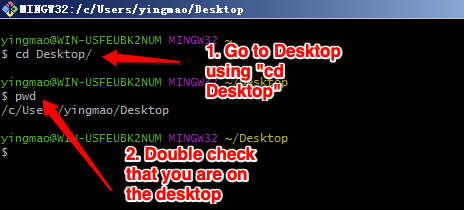
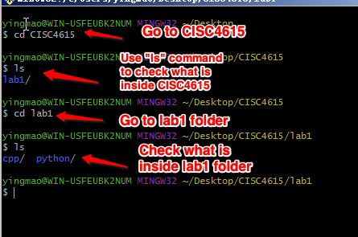
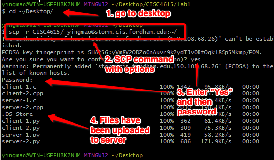
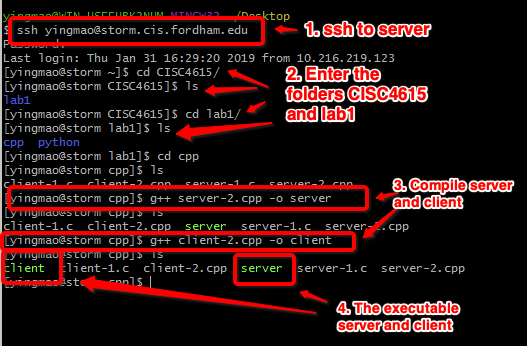
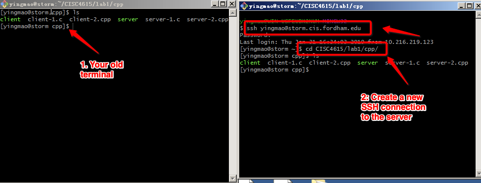
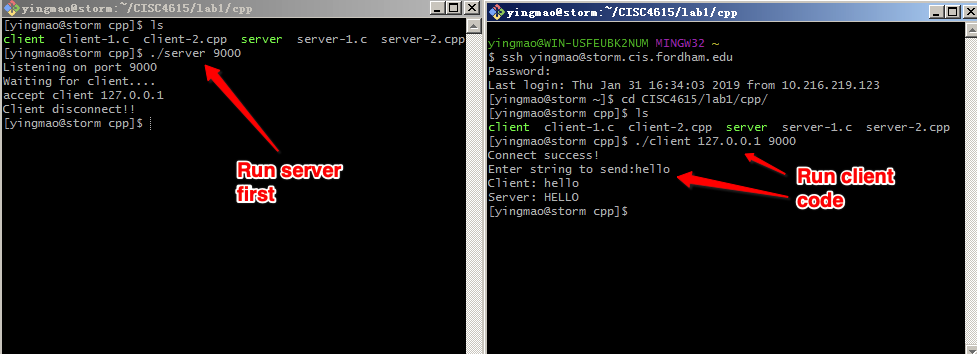
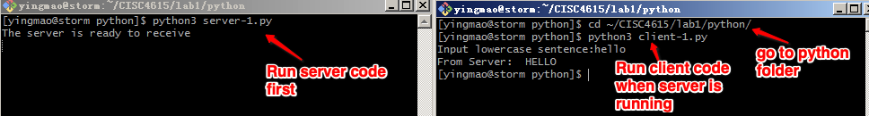

### How to run examples on storm or edros server

- I highly recommend you install a local, terminal-like environment of C/C++ and Python3 on your local machine.

- If you cannot install a local environment, please follow the following toturial to use our storm or edros servers. 

For windows users, please install [Git-Scm](https://git-scm.com/download/win). 

For Mac/Linux users, please use your terminal for the following steps. 

---
- On your laptop, creat a folder named CISC4615 (on the desktop) and inside it, create a folder named lab1, and then, download the sample codes into lab1 folder.

- After the installation, please double click to open git-bash.exe(open terminal if you are using Mac/Linux). 

- On your laptop, creat a folder named CISC4615 (on the desktop) and inside it, create a folder named lab1, and then, download the sample codes into lab1 folder.

- On git-bash.exe (Windows) or Terminal (Mac/Linux), type `cd Desktop` to go to your Desktop. 

- Use command to check your folder.

- Go to the Desktop again and upload the folder using "SCP" command.  

- Use "ssh" to connect to the server and check your code and compile the code. 

- Run the executable code with two terminals. 

 
 
- Run the client and server codes. 
 
 

- Run Python samples.
 
 
 

- You can change your code locally and then, upload the code by using "scp" command that we discussed in step 6, and test your code on the server. 

---